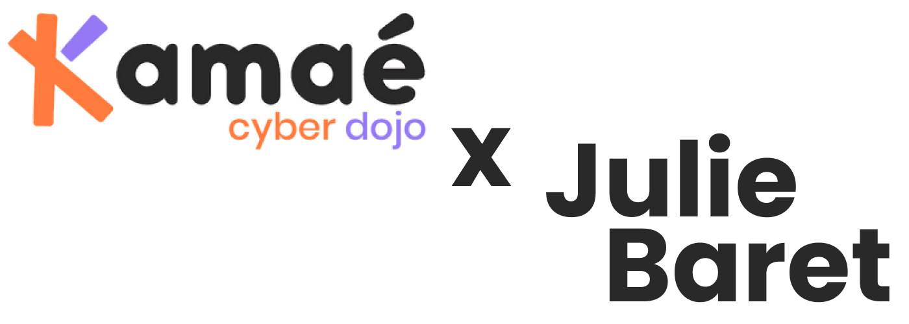
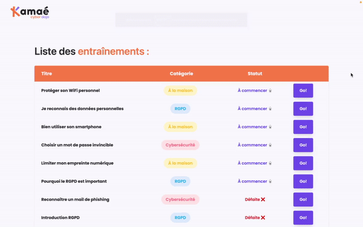

<!-- HEADER -->
<div align="center">
  
  
  <p align="center">
  <a href="#about-the-project">About the project</a> &nbsp;&bull;&nbsp;
  <a href="#getting-started">Getting Started</a> &nbsp;&bull;&nbsp;
  <a href="#usage">Usage</a> &nbsp;&bull;&nbsp;
  <a href="#test">Test</a>  &nbsp;&bull;&nbsp;
  <a href="#documentation">Documentation</a>
  </p>

  <p align="center">
    Mini-project developed for an application for Kamaé.
    <br />
    <a href="./assets/kamae-mini-projet-dev.pdf"><strong>Here are the instructions »</strong></a>
  </p>
</div>

<!-- TABLE OF CONTENTS -->
<details>
  <summary>Table of Contents</summary>
  <ol>
    <li>
      <a href="#about-the-project">About The Project</a>
      <ul>
        <li><a href="#built-with">Built With</a></li>
      </ul>
    </li>
    <li>
      <a href="#getting-started">Getting Started</a>
      <ul>
        <li><a href="#prerequisites">Prerequisites</a></li>
        <li><a href="#installation">Installation</a></li>
      </ul>
    </li>
    <li><a href="#usage">Usage</a>
      <ul>
        <li><a href="#folder-structure">Folder structure</a></li>
      </ul>
    </li>
    <li><a href="#test">Test</a></li>
    <li><a href="#documentation">Documentation</a></li>
  </ol>
</details>

<!-- ABOUT THE PROJECT -->
# About the project
<p>
This simple app offers a table of training exercises related to cybersecurity and the correct use of new technologies. The user can click "Go!" to complete one training exercise and will randomly win or lose. Easy, right ?
</p>
<br>
<p align="center">

</p>

### Built with:
- 
- 
- 
<br>

<!-- GETTING STARTED -->
# Getting Started
Clone down this repository.

## Prerequisites:
You will need `node` and `npm` installed globally on your machine.  

## Installation:

`npm install` 
<p></p><br>

<!-- USAGE -->
# Usage

To launch the project, you'll first have to __start the server__ with this command:

`npm start`  

Then, you'll be able to __visit the app__ at:

`localhost:3000`

## Folder structure:
```
.
├── src .   » Project source code
|       |
|       ├── layouts   » Layouts of the projet (Header, Body, Footer)
|       |
|       └── components    » Several components including ui elements such as Button, Category Column and Status Column
|       
├── public    » Public assets
|
├── assets    » Screenshot, picture and pdf for the README.md file
|
├── README.md   » Current file
|
├── package-lock.json
|
├── package.json
|
├── tailwind.config.js    » Configuration file for Tailwind, a CSS library
|
└── .gitignore
```
<br>

<!-- TEST -->
# Test

One test suite with __6 tests__ :
- the home page should render a heading, a logo and a table;
- the "Go!" button should be clickable;
- the table should have four columns (one for button included);
- the table should have the correct column headers;
- clicking the "Go!" button should decrease the number of trainings to start;
- clicking the "Go!" button should increase the number of trainings won or defeat;

Command to __run the test suite__:

`npm test`  
<br>

<!-- DOCUMENTATION -->
# Documentation
- [Tailwind documentation](https://tailwindcss.com/)
- [React.js documentation](https://beta.reactjs.org/)
